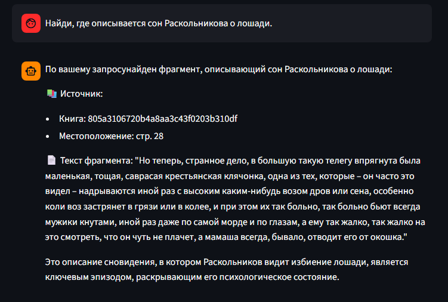
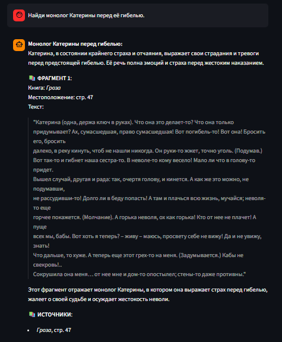

# Примеры запросов и ответов для RAG‑сервиса

Сервис поддерживает два типа запросов:

1. **Поиск фрагмента** — запрос вида «Найди, где говорится про...». Возвращает несколько наиболее релевантных отрывков с указанием книги и места.
2. **Вопрос** — запрос, на который сервис даёт развёрнутый ответ, опираясь на текст книги.

Ниже приведены примеры для трёх книг: «Война и мир», «Преступление и наказание», «Гроза».

## «Преступление и наказание» (Фёдор Достоевский)

### Поиск фрагмента
**Запрос:** *Найди, где описывается сон Раскольникова о лошади.*

**Ответ:**  

---

### Вопрос
**Запрос:** *Какую роль играет Соня Мармеладова в жизни Раскольникова?*

**Ответ:**  
Соня становится для Раскольникова духовным ориентиром. Она первой узнаёт о его преступлении, не осуждает, но побуждает признаться и искупить вину через страдание. На каторге именно её любовь и вера помогают Раскольникову обрести душевное воскресение.

---

## «Гроза» (Александр Островский)

### Поиск фрагмента
**Запрос:** *Найди монолог Катерины перед её гибелью.*

**Ответ:**  

---

### Вопрос
**Запрос:** *Почему Катерина решает признаться в измене мужу?*

**Ответ:**  
Катерина, воспитанная в религиозных традициях, не может жить во лжи. Гроза, которую она воспринимает как Божью кару, вызывает в ней невыносимое чувство вины. Кроме того, она устала от постоянного гнёта Кабанихи и не видит иного способа избавиться от душевных мук, кроме публичного покаяния.

---

**Примечание:** Если в загруженных книгах нет ответа на вопрос, сервис сообщает: *«К сожалению, я не нашёл ответа на ваш вопрос в доступных текстах.»*